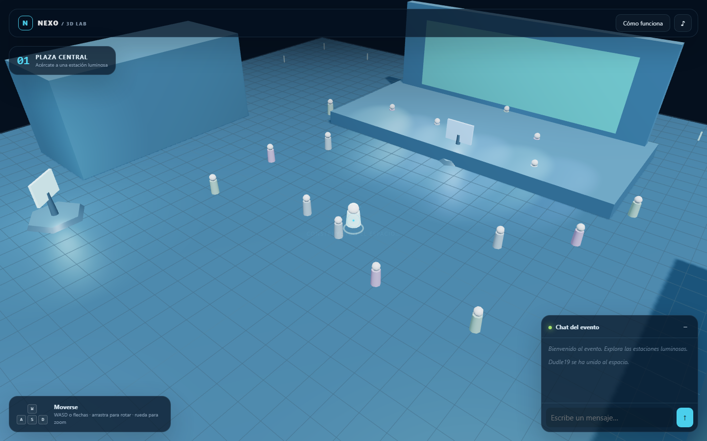

# Nexo 3D — demo modular con Three.js

Experiencia web 3D de una conferencia virtual. Funciona sin compilación: basta servir esta carpeta con Laragon, Apache o cualquier servidor HTTP.



## Tecnología usada

- **Three.js r128** abstrae WebGL y gestiona escena, cámara, luces, materiales, sombras, geometrías y raycasting.
- **JavaScript ES Modules** divide la aplicación por responsabilidades y reduce el acoplamiento.
- **HTML semántico** mantiene formularios, modales y ayudas fuera del canvas para mejorar accesibilidad y mantenimiento.
- **CSS responsive** adapta el sistema visual y los controles a escritorio y móvil.
- **Web Audio API** genera un ambiente sonoro opcional sin archivos de audio.

Three.js se carga desde CDN. Para funcionar sin internet, descarga `three.min.js` r128 dentro del proyecto y cambia su ruta en `index.html`.

## Cómo funciona

El navegador carga `index.html`, Three.js y después `src/app.js`. `ExperienceApp` crea la escena y coordina el ciclo:

1. `requestAnimationFrame` solicita un nuevo cuadro.
2. `PlayerController` interpreta teclado, tacto, arrastre y zoom, actualizando avatar y cámara.
3. La escena anima asistentes y estaciones.
4. Se calcula la estación más cercana y se actualiza la interfaz.
5. Three.js renderiza la escena desde la cámara.

Al hacer clic, un `Raycaster` proyecta una línea desde la cámara hacia el puntero. Si toca una estación cercana, abre su ficha HTML.

## Estructura

```text
demo1/
├── index.html          # Estructura y UI accesible
├── styles/main.css     # Diseño, estados y responsive
└── src/
    ├── app.js          # Orquestador y render loop
    ├── audio.js        # Ambiente sonoro opcional
    ├── config.js       # Contenido y parámetros editables
    ├── kiosks.js       # Estaciones interactivas
    ├── player.js       # Avatar, movimiento y cámara
    ├── scene.js        # Mundo, luces y asistentes
    └── ui.js           # Formularios, chat, modal y guía
```

## Ejecutar

Abre la URL de Laragon correspondiente, por ejemplo `http://localhost/host/proyectos/3dspaces/demo1/`. No uses `file://`: los módulos ES requieren servidor HTTP.

Para demostraciones y capturas puedes precargar el visitante con `?username=Nombre`. Usa `?autostart=Nombre` para entrar automáticamente.

## Usarlo en tu proyecto o página

### Personalizar estaciones

Edita `KIOSKS` en `src/config.js`:

```js
{
  id: 'producto', number: '06', title: 'Mi producto',
  category: 'Demostración', icon: 'MP',
  description: 'Texto de la ficha.', position: [8, 12], color: 0xff8844
}
```

Allí mismo se configuran colores, velocidad, niebla, tamaño del mundo y cámara.

### Cambiar e integrar

- Modifica `createStage`, `createLandmarks` y `createBoundaryLights` en `src/scene.js`.
- Reemplaza geometrías por modelos GLTF/GLB con `GLTFLoader` sin cambiar la arquitectura.
- Sustituye el chat local por WebSocket, Socket.IO, Supabase Realtime o tu backend.
- Carga `KIOSKS` desde un CMS/API y usa el modal para videos, productos o formularios.
- Para incrustarlo en otro layout, conserva `#scene-root`, importa `src/app.js` como módulo y quita `position: fixed` del contenedor.

## Mejoras incluidas

- Arquitectura modular y configuración centralizada.
- Movimiento suavizado, cámara orbital, zoom y límites.
- Controles de teclado, flechas y táctiles.
- Cuatro estaciones con proximidad, raycasting y fichas.
- Escenario, iluminación, sombras, niebla, asistentes y animaciones.
- Chat local seguro: usa nodos de texto para evitar inyección HTML.
- Guía tecnológica integrada, sonido opcional y estados accesibles.
- Diseño responsive y compatibilidad con `prefers-reduced-motion`.

Para producción conviene fijar Three.js como dependencia local, optimizar modelos con Draco/KTX2, añadir colisiones, medir FPS y conectar autenticación/chat a un backend real.
